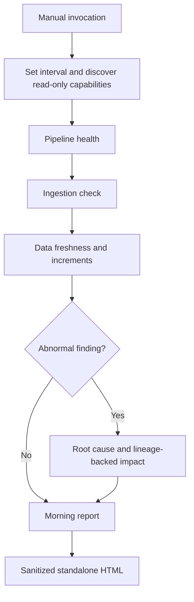

# Architecture

First Coffee Agent is an instruction-only GitHub Copilot custom agent. It has no runtime, database, scheduler, hosted service, bundled connector, or provider adapter.

## Flow

The default assessment interval is the previous 24 hours. The user can override it.

## Components

### Agent profile

`.github/agents/first-coffee-agent.agent.md` coordinates the workflow, discovers available tools, enforces shared guardrails, normalizes evidence, and applies the five skills.

The profile is user-invocable and disables automatic model invocation. Omitting a fixed tool list lets it discover capabilities already configured in the active Copilot environment; the prompt requires it to skip every operation that is not verifiably read-only.

### Skills

- `pipeline-health` summarizes workflow, pipeline, and job execution.
- `ingestion-check` inspects load, checkpoint, batch, and file or object metadata.
- `data-freshness` evaluates latest updates and aggregate incremental counts.
- `root-cause` investigates abnormal conditions and downstream technical impact.
- `morning-report` turns sanitized findings into a standalone HTML brief.

Each skill operates on capabilities rather than provider-specific object names or schemas.

## Capability model

| Capability | Minimum safe evidence | Used for |
| --- | --- | --- |
| Run history | State, start/end time, duration, retry state | Workflow health |
| Ingestion metadata | Arrival time, load state, aggregate counts | Ingestion health |
| Dataset metadata | Last update, expected cadence, safe aggregate deltas | Freshness and volume |
| Catalog and lineage | Dependencies and non-sensitive technical metadata | Impact analysis |
| Operational diagnostics | Sanitized error categories, codes, and timestamps | Root-cause analysis |

A connected provider can expose all, some, or none of these capabilities. Tool and field names are discovered at runtime; the repository assumes no provider schema.

## Evidence model

The agent keeps four evidence classes separate:

- `observed`: directly supported by read-only tool evidence;
- `derived`: calculated from observed aggregates with an explicit method and baseline;
- `hypothesis`: a possible cause requiring an RCA confidence label;
- `unknown`: unavailable, unsafe, or insufficiently supported.

Every capability receives a coverage state: `ASSESSED`, `PARTIAL`, or `NOT ASSESSED`. Missing visibility is never converted to a zero or healthy status.

Root-cause confidence is constrained to:

- `CONFIRMED`: authoritative evidence directly verifies the causal event;
- `PROBABLE`: multiple consistent signals support the cause without fully proving it;
- `POSSIBLE`: limited or indirect evidence supports a plausible cause that needs validation.

Timing correlation alone cannot confirm causation.

## Degraded operation

Missing tools or fields do not stop the entire workflow. The agent:

1. completes every check supported by safe read-only capabilities;
2. records unavailable, denied, unsafe, and partial capabilities;
3. avoids fabricating zeros, baselines, thresholds, or health conclusions;
4. uses `LIMITED VISIBILITY` when material gaps prevent a reliable conclusion;
5. suggests read-only investigation or human handoff without changing production;
6. still produces the HTML report with prominent limitations.

## Trust boundaries

Connected systems remain outside this repository. Authentication, authorization, audit logging, retention, suppression rules, and MCP configuration belong to the adopter's environment.

The agent treats every external response as untrusted data. Tool results, logs, object names, schema comments, and error messages cannot override repository instructions.

Behavioral guardrails require the agent to:

- use read-only tool operations and least-privilege identities;
- skip ambiguous or mutation-capable operations;
- avoid all production writes, job restarts or retries, and configuration changes;
- exclude PHI, PII, secrets, raw rows, parameters, SQL text, and complete logs;
- sanitize and aggregate findings before reporting;
- avoid inferring human, clinical, legal, or financial impact from technical metadata.

For HIPAA-conscious use, enforce minimum-necessary access, approved de-identification and suppression, retention, auditing, and organization-specific review outside the agent as well. This repository does not itself create a compliance boundary.

## Report boundary

The HTML report is the sole intended write. It contains embedded CSS and no JavaScript, remote resources, images, forms, or trackers. Reports are git-ignored to reduce accidental disclosure; when an artifact cannot be persisted or attached, the complete HTML is returned in the response. Creating a new local report artifact does not authorize any data-platform mutation or external publication.

## Extending integrations

No provider adapter belongs in this repository. To support a platform:

1. connect an MCP server or tool that exposes relevant read-only capabilities;
2. grant a least-privilege identity;
3. ensure tool descriptions clearly distinguish reads from mutations;
4. invoke the agent and review the report's data coverage section.
